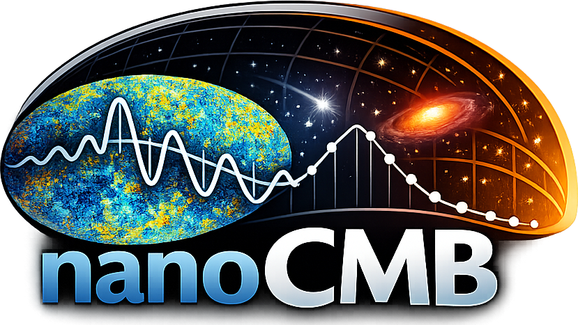
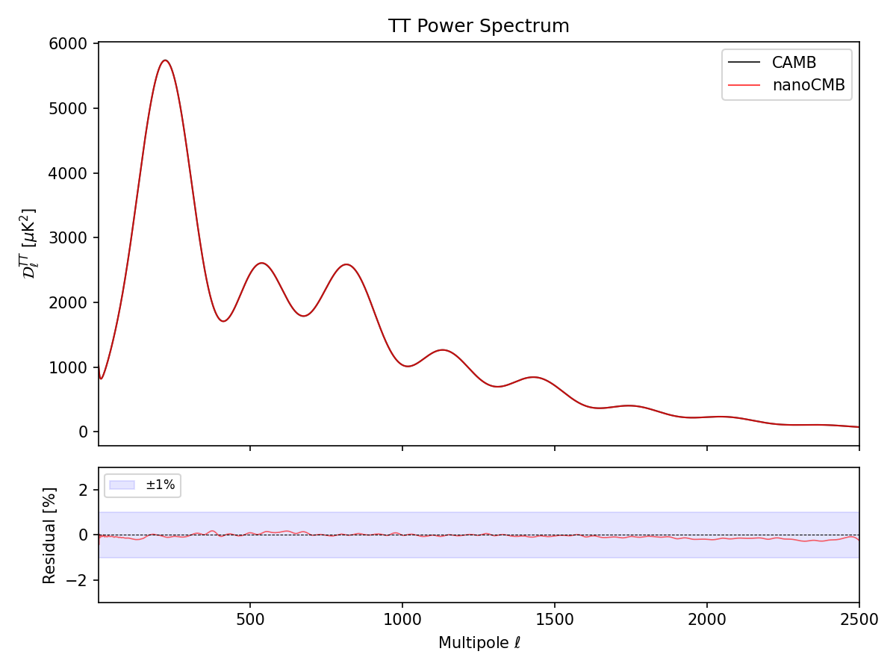
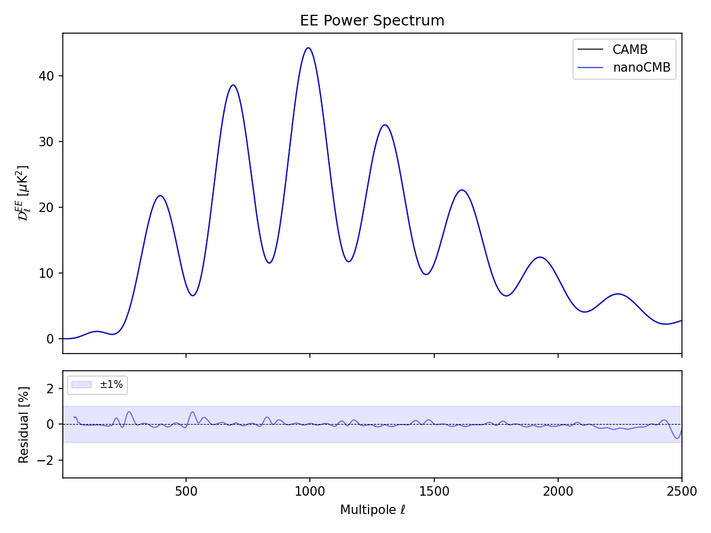
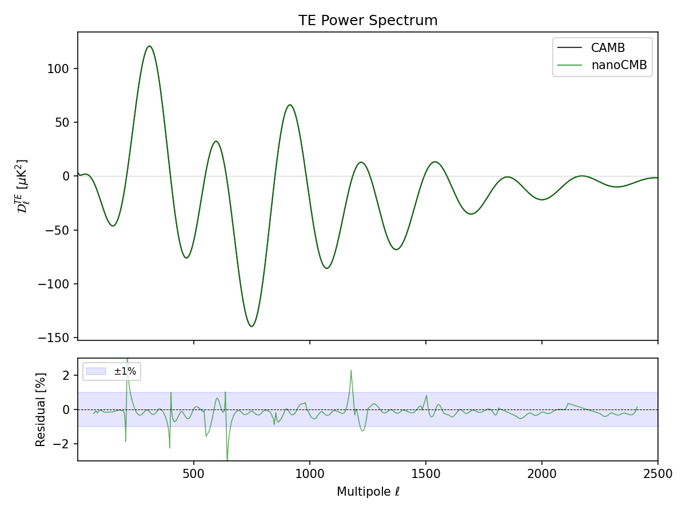

<div align="center">

<h1>nanoCMB</h1>

[](LICENSE)
[](https://python.org)

**A minimal CMB angular power spectrum calculator in ~1400 lines of Python.**

Designed for students learning CMB theory, researchers prototyping new physics, or anyone who wants to understand what a Boltzmann solver actually does. The entire calculation lives in a single readable Python file.

Computes the unlensed TT, EE, and TE angular power spectra for flat LCDM cosmologies from first principles: Friedmann equation, RECFAST recombination, Boltzmann hierarchy in synchronous gauge, line-of-sight integration with precomputed Bessel tables, and optimally constructed non-uniform grids. Matches [CAMB](https://github.com/cmbant/CAMB) to sub-percent accuracy on the unlensed spectra. Since lensing is not included, the output should not be compared directly to observed CMB data.

Contributions welcome — whether it's improving speed, accuracy, conciseness, or adding new physics. **Pull requests encouraged!**
</div>

* [Quick start](#quick-start)
* [Validation](#validation)
* [Accuracy](#accuracy)
* [What's inside](#whats-inside)
* [Approximations](#approximations)
* [Dependencies](#dependencies)
* [Contributing](#contributing)
* [Citation](#citation)

## Spectra







## Quick start

```bash
python nanocmb.py
```

Runs in ~30s on a modern multi-core machine (~10s with optional Numba JIT). The first run takes longer as it builds and caches spherical Bessel function tables; subsequent runs reuse the cache.

Output is saved to `nanocmb_output.npz` with arrays `ells`, `DlTT`, `DlEE`, `DlTE` (D_l in muK^2).

## Validation

Compare against CAMB and generate plots:

```bash
pip install camb matplotlib
python scripts/validate.py
```

This produces comparison plots in `plots/` with residual panels.

## Accuracy

Validated against CAMB (AccuracyBoost=3) with Planck 2018 best-fit parameters:

| l range | TT (mean ratio) | TT (std) | EE (mean ratio) | EE (std) |
|---------|:---:|:---:|:---:|:---:|
| 2-29 | 0.9993 | 0.08% | 1.0013 | 0.99% |
| 30-499 | 0.9996 | 0.09% | 1.0005 | 0.22% |
| 500-1999 | 0.9998 | 0.08% | 1.0003 | 0.13% |
| 2000-2500 | 0.9982 | 0.05% | 0.9986 | 0.20% |

A multi-cosmology benchmark across 50 flat LCDM cosmologies (spanning +/-3 sigma of the Planck 2018 posterior) confirms sub-percent accuracy across the full range, with median TT RMS residuals of ~0.1%.

## What's inside

The entire calculation lives in `nanocmb.py`, structured as a top-to-bottom pipeline:

1. **Background cosmology** -- Friedmann equation, conformal time, sound horizon
2. **Recombination** -- Full RECFAST (H + He ODEs, matter temperature, Hswitch corrections), reionisation, visibility function
3. **Grid construction** -- Optimal non-uniform grids in k and tau via error equidistribution
4. **Perturbations** -- Boltzmann hierarchy in synchronous gauge (CDM frame) with tight-coupling approximation
5. **Source functions** -- Multi-channel IBP decomposition with ISW, Doppler, and quadrupole terms
6. **Line-of-sight integration** -- Precomputed Bessel tables with dead-zone skipping and recurrence derivatives
7. **Power spectrum assembly** -- Primordial spectrum, k-integration on fine grid, l-interpolation

## Approximations

- Flat geometry (K = 0)
- Massless neutrinos only
- Cosmological constant (w = -1)
- No lensing, no tensors, no isocurvature modes
- First-order tight-coupling approximation

## Dependencies

- numpy
- scipy
- numba (optional, for ~3x speedup)

That's it. CAMB and matplotlib are only needed for `validate.py`.

## Default parameters

Planck 2018 best-fit flat LCDM:

| Parameter | Symbol | Value |
|-----------|:------:|------:|
| Hubble parameter | H0 | 67.36 km/s/Mpc |
| Baryon density | omega_b h^2 | 0.02237 |
| CDM density | omega_c h^2 | 0.1200 |
| Optical depth | tau | 0.0544 |
| Scalar spectral index | n_s | 0.9649 |
| Scalar amplitude | A_s | 2.1e-9 |
| Effective neutrino number | N_eff | 3.044 |

## Contributing

Contributions are welcome! In particular:

- **Performance improvements** -- Faster ODE integration, better parallelisation, reduced memory usage, or other optimisations that cut runtime without sacrificing accuracy.
- **Accuracy improvements** -- Better tight-coupling schemes, higher-order corrections, improved grid strategies, or other changes that reduce residuals vs CAMB.
- **New physics** -- Extensions such as gravitational lensing, tensor modes, massive neutrinos, spatial curvature, or non-standard dark energy. The modular structure is designed to make these additions straightforward.
- **Bug fixes** -- If you find a discrepancy or numerical issue, please open an issue or submit a fix.

Please keep contributions consistent with the project philosophy: everything in a single readable Python file, minimal dependencies, and every approximation made explicit.

## Citation

If you use nanoCMB in your research, please cite the accompanying paper (submitted to Astronomy and Computing).

## License

MIT
